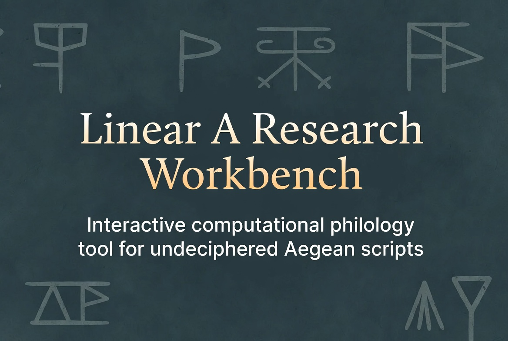

# Linear A Research Workbench

A computational research environment for the **Linear A** corpus — the
undeciphered Bronze Age Minoan script (~1800–1450 BCE). Built as a
zero-dependency-at-runtime browser SPA that you can use online, run
locally, or fork and extend.

**Status**: experimental research tool. Not authoritative. See
[Caveats](#caveats) below.

[](https://github.com/ryanpavlicek/linearaworkbench/actions/workflows/ci.yml)
[](LICENSE)
[](#architecture)

---

## Use it right now

**▶ <https://linearaworkbench.xyz/>** — nothing to
install; it runs in any modern browser and keeps working offline after
your first visit.



New to Linear A? Five things to try in your first five minutes:

1. **Check Bronze Age arithmetic** — open *Accounting & Metrology* and see
   which tablets' stated totals actually balance (HT13 is off by half a
   unit — was it the scribe?).
2. **Search the corpus** — press `Ctrl+/`, type `KU-RO` (the word that
   marks a total), and click a result to see the tablet, its photographs,
   and the scholarly commentary.
3. **See where it was all found** — *Geography* maps every findspot across
   Crete; click a site for its tablets.
4. **Compare two tablets side by side** — *Compare Inscriptions* aligns
   them word by word and highlights what they share.
5. **Share what you found** — the address bar always points at exactly
   what you're looking at; copy the link and send it to anyone.

The in-app **Help** (press `?`) includes guided recipes for real research
questions, and the first-run welcome offers one-click starting points.


## What this is

About **1,400–1,500 Linear A documents** survive — on clay tablets,
sealings, and libation tables, from sites across Crete and the Aegean.
The upstream transcription (mwenge/lineara.xyz, following GORILA)
splits these into **1,721 tagged entries** (separately-numbered
sealings, obverse/reverse faces, etc.) and that's what this workbench
loads and analyzes; see [Methodology](docs/METHODOLOGY.md#corpus-normalization)
for the count distinction. We can read most of the *sounds* (the script
shares ~60% of its signs with the deciphered Linear B), but not the
language. The corpus is small, fragmentary, and mostly administrative.

This workbench gives you **50 interactive modules** for analyzing that
corpus: searching, browsing, statistics, sign concordances, accounting verification,
cross-language phonetic alignment, hypothesis testing, annotation, mapping,
comparison. Everything is keyboard-accessible, mostly works offline, and
persists your work to
the browser.

## Highlights

| | |
|---|---|
| **Search & browse** | Full-corpus search, a page-through browser with a by-glyph index and an imagery contact sheet, a glyph-palette keyboard, and a command palette (`Ctrl+K`) that jumps to any module, tablet, word, or site. |
| **Read the scholarship** | All 1,694 of John Younger's pre-2024 commentary docs, full-text searchable and rendered beside the tablets they discuss, plus facsimiles and photographs of nearly every inscription. |
| **Signs & structure** | Sign inventory with SigLA paleography links, concordances, graphotactic transition heatmaps, wildcard sign-pattern search (`KU-*-RO`), positional grammar, and sequence patterns. |
| **Statistics** | Word frequency, KWIC concordance, collocation (PMI, G², χ², Fisher's exact), lexical statistics with Zipf curves, similarity clustering, stem families, minimal pairs. |
| **Accounting & content** | Machine-verified KU-RO arithmetic on every accounting tablet, a commodity catalog, tablet-structure classification, and libation-formula analysis. |
| **Hypothesis testing** | A cross-linguistic alignment matrix against nine reference languages with live tuning sliders, sound-shift what-ifs with match-delta scoring, and a name-candidates vetting queue. |
| **Geography & scribes** | An interactive findspot map with word overlays, per-scribe sign profiles, pairwise comparison, and a scribal network. |
| **Your research** | Annotate any word or tablet, build collections, save findings with their actual result tables, write cross-referenced Markdown notes, watch My Lexicon aggregate it all into a working glossary, and compile everything into an interactive single-file report with one-click citations. |
| **Data in & out** | Permalinks to everything, CSV export on every table, a versioned full-corpus JSON export, a [static data API](docs/API.md), [live embeds](#embedding), one-file backup/restore, and folder auto-backup. Annotations export and re-import with a merge mode, so two researchers can swap and combine their readings. Take it further with an [Obsidian vault or NotebookLM bundle export](docs/FEATURES.md), or [bring your own corpus](#bring-your-own-corpus). |

The complete module-by-module tour — all 39 — is in
[docs/FEATURES.md](docs/FEATURES.md).

## Run it locally

You only need this to develop, customize, or run from source — the
[live site](https://linearaworkbench.xyz/) is the same
app and already works offline after your first visit.

1. **Install Node.js** (the JavaScript runtime the build tools need):
   download the LTS version from <https://nodejs.org> and install with the
   defaults. To confirm it worked, open a terminal (PowerShell on Windows,
   Terminal on macOS) and run `node --version`.
2. **Get the code** — `git clone https://github.com/ryanpavlicek/linearaworkbench.git`,
   or, without git, use *Code → Download ZIP* on the GitHub page and unzip it.
3. **Install and start** — in a terminal, inside the project folder:

```bash
npm install     # first time only — a few minutes
npm run dev
```

Open <http://localhost:5173>.

**Everything works out of the box.** The repo ships with the full corpus
(~1.5 MB of JSON) plus the entire upstream auxiliary mirror (~500 MB) —
commentary HTML, facsimile images, GORILA PDFs — all of it. Search, sign
inventory, network graphs, hypothesis testing, the map, the facsimile and
Commentary ↗ links, even the fonts (the Linear A glyph font included) all
serve from the repo itself: zero external dependencies at runtime. After
your first visit a service worker caches the app shell, corpus, and fonts,
so the workbench keeps working offline.

> ⚠️ Heads up: the repo is **~500 MB** because of the bundled auxiliary
> mirror. The trade-off is that the GitHub Pages deployment carries its
> own data — the corpus, commentary, and imagery keep working even if the
> upstream sources go offline. See
> [Saving repo size](#saving-repo-size-optional) if you'd prefer a small
> repo with runtime CDN fallback instead.

## Saving repo size (optional)

If you'd rather keep the repo small (~5 MB), you can gitignore the 500 MB
`public/upstream/` mirror and have the app load commentary and facsimile
images from upstream CDNs at runtime:

```bash
echo "public/upstream/" >> .gitignore
git rm -r --cached public/upstream
cp .env.example .env.local
# uncomment the two VITE_ASSET_BASE / VITE_COMMENTARY_BASE lines
```

**Tradeoff**: you save ~500 MB but the deployed site now depends on
mwenge/lineara.xyz staying online. The analytical tools still work
regardless — only the Commentary ↗ and Facsimile/Photograph buttons
would break if the upstream went down.

To regenerate the bundled mirror later (after the gitignore change is
reverted):

```bash
npm run assets:fetch     # ~10–20 min, repopulates public/upstream/
```

## Architecture

- **Stack**: Vite + React 18 + TypeScript + Zustand. Zero non-essential
  runtime dependencies.
- **Code splitting**: each module ships as its own lazy chunk (typically
  1–6 KB gzipped; the Research hub is the largest at ~23 KB). Main shell
  is ~82 KB gzipped.
- **State**: localStorage-backed for annotations, collections, saved
  queries, saved hypotheses, pins, display preferences. Namespaced under
  `linear-a-workbench:`.
- **Corpus**: pre-built JSON in `public/corpus/`. Regenerated via
  `npm run corpus:fetch` from the upstream
  [mwenge/lineara.xyz](https://github.com/mwenge/lineara.xyz) source.
- **Upstream mirror**: pre-fetched copy of commentary HTML, facsimile
  images, and GORILA PDFs lives in `public/upstream/` and is committed
  to the repo so deployments are fully self-contained. Regenerated via
  `npm run assets:fetch`.
- **Sign mapping**: derived empirically by aligning the upstream's
  transliterations with its parsed glyph strings codepoint-by-codepoint.
  Confidence scores per sign are reported in the Sign Inventory module.
- **Glyphs**: rendered via [Noto Sans Linear A](https://fonts.google.com/noto/specimen/Noto+Sans+Linear+A),
  self-hosted with the other UI fonts in `public/fonts/` (regenerate with
  `node scripts/fetch-fonts.mjs`; all four families are OFL-licensed).
- **Offline**: a small service worker (`public/sw.js`) caches the app
  shell, corpus JSON, and fonts after the first visit. The 500 MB upstream
  mirror is deliberately not precached — facsimiles and commentary load
  network-first and cache as you view them.
- **Permalinks**: the URL hash carries the active module, open tablet/word,
  and corpus scope (`#/i/HT13`, `#/m/freq?site=Haghia+Triada`) — share a
  link to exactly what you're looking at.
- **Asset paths**: configurable via `VITE_ASSET_BASE` and
  `VITE_COMMENTARY_BASE` env vars; default to the bundled local mirror.

See [`docs/METHODOLOGY.md`](docs/METHODOLOGY.md) for the math (phonetic
distance formula, PMI, alignment derivation) and known limitations.

## Data API

The deployed site also publishes the corpus as static JSON at stable,
versioned URLs — the full schema-v1 export with derived analyses, one file
per inscription, and an id manifest:

```bash
curl -s https://linearaworkbench.xyz/api/v1/inscriptions/HT13.json | jq '.derived.balance'
```

See [`docs/API.md`](docs/API.md) for the endpoints, schema stability
guarantees, and pandas examples.

## Embedding

Any tablet embeds as a live, chromeless card — glyphs, transliteration,
facsimile thumbnail, and a link back to the full workbench:

```html
<iframe
  src="https://linearaworkbench.xyz/?embed=1#/i/HT13"
  width="420" height="380" loading="lazy"
  title="Linear A tablet HT13">
</iframe>
```

## Bring your own corpus

Every analysis module can run against an inscription set you supply instead
of the bundled corpus — for the length of a browser session:

- **From a URL**: `?corpus=<url-to-json>` loads the document and opens the
  workbench on it (the URL must allow cross-origin reads — a GitHub raw
  link or Pages site works).
- **From a file**: *Data Export → Bring your own corpus* picks a local
  JSON file.

Both accept either a plain array of inscription records or a workbench
corpus export (the schema-v1 object Data Export and the data API produce).
Only `id` plus some text (`words`, `lines`, or `transcription`) are
required per record; missing metadata gets sensible defaults. That makes
round trips easy: export a scope-filtered corpus here and reload it later,
or build one in Python with pyaegean's `to_workbench()` and point the
workbench at it. The top bar shows a "custom corpus" tag while one is
active; reloading without the parameter restores the bundled corpus.

## Keyboard

- `Ctrl + K` — Command palette (jump to any module by name)
- `Ctrl + /` — Corpus Search
- `Ctrl + Z` — Undo last reversible action
- `?` or `/` — Open the in-app help
- `Esc` — Close detail modal
- `Alt + ←` / `Alt + →` — Step inscription navigator (inside detail)
- On the Findspot Map (when focused): arrow keys pan, `+`/`-` zoom, `0` resets

## Project layout

```
linearaworkbench/
├── public/
│   ├── corpus/             # Pre-built inscription + sign + commentary-index JSON (~1.5 MB)
│   └── upstream/           # Bundled commentary + images + papers (~500 MB)
├── scripts/
│   ├── build-corpus.mjs    # Normalize upstream corpus → JSON
│   ├── fetch-corpus.mjs    # Pull upstream + rebuild
│   ├── build-commentary-index.mjs  # Full-text index over the commentary mirror
│   └── fetch-assets.mjs    # Re-mirror upstream commentary + images + PDFs
├── src/
│   ├── components/         # Shared UI (TopBar, Sidebar, DetailModal, ...)
│   ├── data/               # Sign data, language wordlists, site coords
│   ├── lib/                # Algorithms, helpers, types, persistence
│   ├── modules/            # The analysis panels (lazy-loaded)
│   ├── store/              # Zustand workbench store
│   └── test/               # jsdom integration + module smoke harness
├── e2e/                    # Playwright browser smoke tests
├── docs/
│   └── METHODOLOGY.md      # Technical detail on the analytical methods
├── .github/
│   ├── workflows/          # CI + Pages auto-deploy
│   └── ISSUE_TEMPLATE/     # Bug, feature, data correction templates
└── .env.example            # How to swap bundled assets for upstream CDN
```

## Citations

If you use this workbench in academic work, **primary citations should go
to the underlying corpus sources**:

- **GORILA**: Godart, L. & Olivier, J.-P. (1976–1985). *Recueil des
  inscriptions en linéaire A*. École Française d'Athènes. All five
  volumes are readable online in the École's digital library,
  [CEFAEL](https://cefael.efa.gr/result.php?serie_title_operator=con&volume_number_operator=%3D&issue_year_operator=%3D&section_title=Recueil+des+inscriptions+en+lin%C3%A9aire+A&section_title_operator=con&author_lastname_operator=con&publisher_name_operator=con&site_id=1&actionID=advanced&operator=AND).
- **mwenge/lineara.xyz**: the digital transcription of the corpus this
  tool builds on, at <https://github.com/mwenge/lineara.xyz>.
- **John Younger's Linear A material** (2024): scholarly commentary
  referenced throughout, now hosted as PDFs on academia.edu at
  <https://www.academia.edu/117949722/Younger_JG_Linear_A_folder_introduction>.
  Younger moved off the KU secondary server (his previous host) in 2024;
  the workbench bundles a mirror of his pre-2024 commentary HTML (via
  lineara.xyz) and renders it inline in every inscription detail.

The workbench itself is exploratory infrastructure on top of that scholarship.
Analytical claims in your paper should reference the primary sources above.

If your work specifically uses the workbench's analytical features (the
alignment matrix, sound-shift hypotheses, accounting reconciliations, the
report's captured result tables, etc.) or you want to enable reproducibility,
**please also cite the workbench itself**. A [`CITATION.cff`](CITATION.cff) is
provided — GitHub's "Cite this repository" button (right sidebar of the repo
page) generates APA / BibTeX in one click, and Zotero / Mendeley pick it up
automatically. The in-app Research Report's **+ Citation block** also emits
pre-formatted workbench citations alongside the corpus sources in BibTeX /
APA / Chicago / MLA — pinned to the version and snapshot date for
reproducibility.

## Caveats

- **No editorial authority.** I make no claims about what Linear A
  actually means. All comparisons, alignments, and statistics are
  exploratory tools. Every analytical module carries a small **Descriptive**
  or **Exploratory** badge at the top of its panel so the calibration is
  visible at the point of use, not just buried in the docs.
- **Comparison wordlists are illustrative.** The nine reference-language
  wordlists in `src/data/languages.ts` are short editorial collections;
  they are not exhaustive and have not been peer-reviewed by specialists.
- **Glyph mapping is empirical, not paleographic.** The workbench uses
  idealized Unicode characters. For per-scribe variant analysis, use
  [SigLA](https://sigla.phis.me) or similar paleographic resources.
- **Sign mapping confidence < 100%.** The corpus has some misaligned or
  uncertain readings; see the confidence column in the Sign Inventory.
- **Cross-language phonetic distance is heuristic.** The weighted
  Levenshtein formula reflects general typological intuitions, not a
  trained model. See the methodology doc — also available in-app under
  Help → Methodology.

## Contributing

See [CONTRIBUTING.md](CONTRIBUTING.md). Bug reports, data corrections,
and new analysis modules all welcome.

## License

[Apache License 2.0](LICENSE). The Apache 2.0 terms apply to the code and
bundled corpus JSON. Attribution requirements (preserve copyright notices,
include a copy of the [NOTICE](NOTICE) file in derivative works) are
spelled out in the license itself.

Facsimile images and GORILA PDFs hosted via the upstream remain © École
Française d'Athènes and are loaded for academic reference only — they are
NOT redistributed under the Apache 2.0 license. See [NOTICE](NOTICE) for the
full third-party attribution list.

## Related work

- **[John Younger's Linear A material](https://www.academia.edu/117949722/Younger_JG_Linear_A_folder_introduction)**
  (2024, academia.edu) — the canonical scholarly online reference,
  reorganized as PDFs after the KU secondary server was retired in
  2024. Every inscription detail in the workbench renders the bundled
  pre-2024 commentary inline and points readers to the academia.edu
  folder for current material.
- **[mwenge/lineara.xyz](https://github.com/mwenge/lineara.xyz)** —
  visual catalog with tablet imagery and zoom. The workbench bundles their
  corpus transcription and commentary mirror; complementary tool overall.
- **[pyaegean](https://github.com/ryanpavlicek/pyaegean)** — if you'd
  rather work in Python, I also maintain pyaegean
  (`pip install pyaegean`). It ports this workbench's Linear A analysis —
  sign-pattern search, phonetic distance and alignment, collocation
  statistics, the query engine — tested against the same expected values,
  and adds what a browser app can't: scriptable corpus access, pandas
  DataFrames, Ancient Greek NLP, and citation/provenance output for
  papers. The two tools stay on the same data (the corpus manifest is
  checked on both sides), and the Query Builder and tablet views can copy
  ready-to-run pyaegean code.
- **[SigLA](https://sigla.phis.me)** — paleographic database of Linear A
  signs by scribe. Use this for sign-variant analysis.
- **[DAMOS](https://damos.hf.uio.no)** — the Mycenaean (Linear B) corpus
  at Oslo; sister-script database.
- **[GORILA](https://cefael.efa.gr/result.php?serie_title_operator=con&volume_number_operator=%3D&issue_year_operator=%3D&section_title=Recueil+des+inscriptions+en+lin%C3%A9aire+A&section_title_operator=con&author_lastname_operator=con&publisher_name_operator=con&site_id=1&actionID=advanced&operator=AND)**
  — Godart, L. & Olivier, J.-P. (1976–1985). *Recueil des
  inscriptions en linéaire A* (École Française d'Athènes). The printed
  scholarly edition all digital projects derive from — digitized in the
  École's CEFAEL library at the link.

## Acknowledgements

This workbench would not exist without the volunteer labor of
[mwenge](https://github.com/mwenge), whose transcription of the GORILA
corpus into structured JSON is the data foundation here. John Younger's
decades of scholarly editorial work is the secondary literature source.
The École Française d'Athènes holds the rights to the facsimile imagery
mirrored from the upstream repository.

## About the author
Ryan Pavlicek

I'm a software engineer in Cincinnati, Ohio. My classical-languages credentials
start and end at amateur Koine Greek — 85-90% proficient enough to read the
Biblical New Testament in Greek, no further. I'm not a classicist, not a 
Linear A researcher, and I have no delusions about becoming one
in mid-life. Creating a tool for working with Linear A seemed like an
interesting engineering problem to tackle.

If something here is wrong, please open an issue on github.

**Email**: 'ryan [dot] pavlicek [dot] github [at] gmail [dot] com'

*(Replace `[at]` with `@` and `[dot]` with `.`)*
